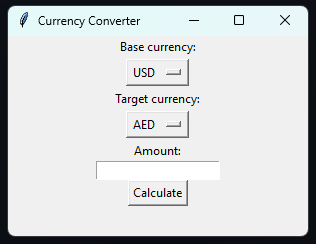

# CurrencyExchange

This Python script is a simple currency converter that uses the Open Exchange Rates API to retrieve the latest currency exchange rates. It allows users to convert any amount of one currency to another based on the current exchange rates. The script uses the Tkinter library for the GUI, and the API key is passed as an environmental variable.

 
<h3>GUI</h3>

 
